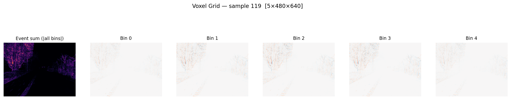
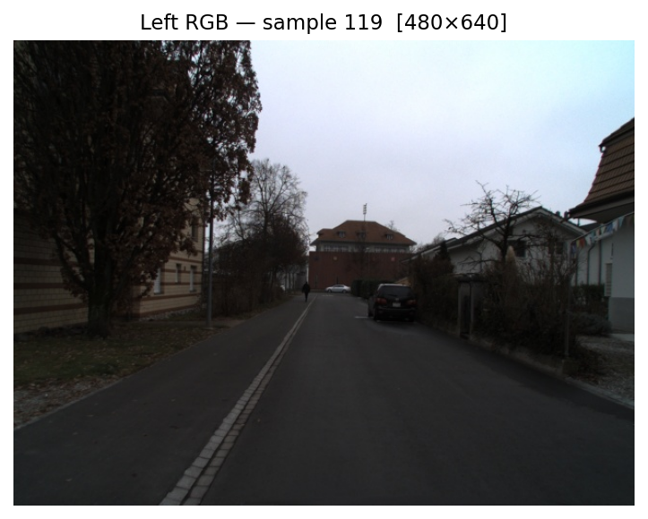
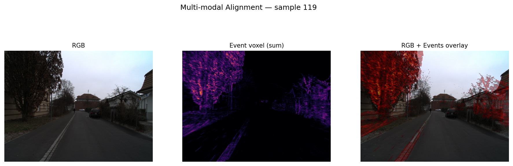
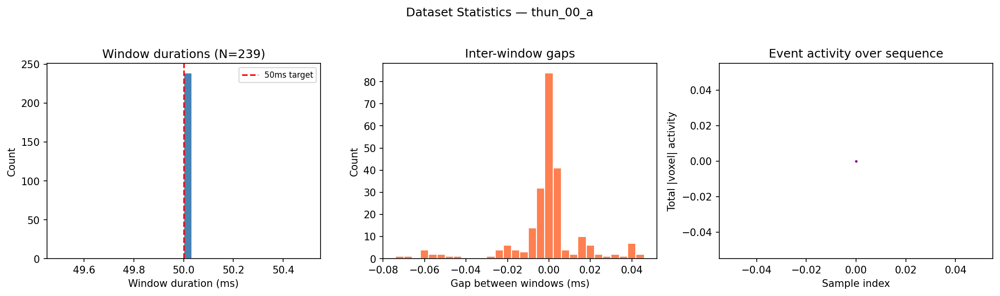

# ENavi++ Data Pipeline

A modular data pipeline for **event-camera-based navigation** research. Currently focused on the [DSEC](https://dsec.ifi.uzh.ch/) stereo event camera dataset. Inspired by [NoMaD](https://general-navigation-models.github.io/)-style past-context setups, adapted to event voxel space.

> **This is a data pipeline repo** — it handles downloading, visualizing, preprocessing, and loading event camera datasets. Model training code lives separately.

---

## Pipeline Stages

| Stage | Status | Description |
|-------|--------|-------------|
| **1. Download** | Done | Scripts to download DSEC (debug subset or full, events + RGB + lidar/IMU) |
| **2. Visualize & Understand** | Done | Load raw data, inspect formats, save visualizations |
| **3. Preprocess** | Done | Convert raw events + RGB + IMU to aligned H5 files |
| **4. Dataloader** | Done | PyTorch Dataset/DataLoader with history stacking (P=5) |

See [docs/ROADMAP.md](docs/ROADMAP.md) for the full roadmap.

---

## Quick Start

```bash
# 1. Download & extract debug subset (~1.5 GB with RGB)
bash scripts/download_dsec.sh --mode debug --include_images 1
bash scripts/extract_dsec.sh  --mode debug --include_images 1

# 2. Inspect raw data (uses vendored DSEC loader)
python scripts/inspect_dsec.py --dsec_root data/raw/DSEC --num_batches 3

# 3. Preprocess to H5 (5-bin voxels @ 50ms + aligned RGB + IMU)
python scripts/preprocess_dsec_to_h5.py \
    --config configs/preprocess/dsec_bins5_50ms_480x640.yaml \
    --dsec_root data/raw/DSEC --split train --sequence thun_00_a \
    --out data/processed/DSEC/thun_00_a_bins5_50ms_480x640_rgb_imu.h5 \
    --include_rgb 1 --include_imu 1 \
    --lidar_imu_root data/raw/DSEC/lidar_imu

# 4. Validate time-sync (events ↔ RGB ↔ IMU)
python scripts/validate_preprocessed_h5.py \
    --h5 data/processed/DSEC/thun_00_a_bins5_50ms_480x640_rgb_imu.h5 \
    --sequence thun_00_a

# 5. Inspect with history stacking (P=5, NoMaD-style)
python scripts/inspect_h5_history.py \
    --h5 data/processed/DSEC/thun_00_a_bins5_50ms_480x640_rgb_imu.h5 \
    --history 5

# 6. Use in Python
python -c "
import sys; sys.path.insert(0, 'src')
from enavipp.data.datasets import EnavippH5Dataset, collate_enavipp
from torch.utils.data import DataLoader

ds = EnavippH5Dataset('data/processed/DSEC/thun_00_a_bins5_50ms_480x640_rgb_imu.h5',
                      load_rgb=True, load_imu=True, history=5)
dl = DataLoader(ds, batch_size=4, collate_fn=collate_enavipp)
batch = next(iter(dl))
print(batch['voxel'].shape)    # torch.Size([4, 5, 5, 480, 640])  (B,P,C,H,W)
print(batch['rgb_left'].shape) # torch.Size([4, 5, 3, 480, 640])  (B,P,3,H,W)
"
```

---

## Stage 1: Download DSEC

The DSEC dataset is a large-scale stereo event camera dataset for driving scenarios, captured in Zurich. Download page: https://dsec.ifi.uzh.ch/dsec-datasets/download/

### Debug subset (single sequence)

Downloads `thun_00_a` — one short driving sequence. Events + disparity (~560 MB), add `--include_images 1` for RGB (~1.5 GB total).

```bash
# Events + disparity only
bash scripts/download_dsec.sh --mode debug
bash scripts/extract_dsec.sh  --mode debug

# Events + disparity + RGB images
bash scripts/download_dsec.sh --mode debug --include_images 1
bash scripts/extract_dsec.sh  --mode debug --include_images 1

# Events + disparity + RGB + lidar/IMU (adds ~3.8 GB global archive)
bash scripts/download_dsec.sh --mode debug --include_images 1 --include_lidar_imu 1
bash scripts/extract_dsec.sh  --mode debug --include_images 1 --include_lidar_imu 1
```

### Full training set

```bash
bash scripts/download_dsec.sh --mode full --include_images 1
bash scripts/extract_dsec.sh  --mode full --include_images 1
```

### Script flags

| Flag | Default | Description |
|------|---------|-------------|
| `--mode` | `debug` | `debug` (single sequence) or `full` (all train) |
| `--split` | `train` | DSEC split name |
| `--sequence` | `thun_00_a` | Sequence name (debug mode only) |
| `--include_images` | `1` | Download/extract RGB images |
| `--include_lidar_imu` | `0` | Download/extract lidar + IMU (~3.8 GB) |

Scripts are **idempotent** — re-running skips already-downloaded/extracted files. Uses `aria2c` if available, falls back to `curl` with resume support.

### Extracted directory structure

```
data/raw/DSEC/
  train/
    thun_00_a/
      events/
        left/
          events.h5             # Raw events (requires hdf5plugin)
          rectify_map.h5        # Undistortion map
        right/
          events.h5
          rectify_map.h5
      disparity/
        timestamps.txt          # Microsecond timestamps
        event/
          000000.png ... 000238.png   # 16-bit PNG disparity maps
      images/                   # (if --include_images 1)
        image_timestamps.txt    # Microsecond timestamps (239 frames)
        left/rectified/
          000000.png ... 000238.png   # RGB frames
        right/rectified/
          000000.png ... 000238.png
      calibration/              # cam_to_cam.yaml, cam_to_lidar.yaml
```

---

## Stage 2: Visualize & Understand Raw Data

### Inspect raw voxel grids

```bash
python scripts/inspect_dsec.py \
    --dsec_root data/raw/DSEC \
    --num_batches 3 \
    --save_dir artifacts/inspect
```

Output:
```
Dataset length: 119
Batch 0: vox_left shape=(1, 15, 480, 640) disp shape=(1, 480, 640) nonzero_frac=0.268
Batch 1: vox_left shape=(1, 15, 480, 640) disp shape=(1, 480, 640) nonzero_frac=0.229
Saved visualizations to: artifacts/inspect
```

Saves `event_sum_b*.png` (voxel sum heatmap) and `disparity_b*.png` (GT disparity).

### DSEC data format

**Events** in HDF5 (`events.h5`, requires `hdf5plugin`):
```
events/x -> uint16, events/y -> uint16, events/p -> uint8, events/t -> uint32 (relative us)
ms_to_idx -> int64 (fast slicing lookup), t_offset -> int64 (add to t for absolute timestamps)
```

**Disparity GT**: 16-bit PNG, `disp_float32 = imread(path, IMREAD_ANYDEPTH).astype('f4') / 256`

**Image timestamps**: one integer per line (microseconds), 239 frames for thun_00_a. Note: event timestamps and image timestamps are both in microseconds but reference the same clock system.

---

## Stage 3: Preprocess to H5

The preprocessing pipeline converts a raw DSEC sequence into a single HDF5 file containing:
- **Voxel grids** — `[num_bins, H, W]` float16, one per anchor timestamp
- **JPEG-encoded RGB** — stored as variable-length byte arrays (saves ~80% vs raw)
- **IMU** — accelerometer + gyroscope as ragged arrays with per-window pointer indexing
- **Disparity GT index** — index into the disparity PNG frames
- **Timestamps** — microsecond start/end for each voxel window

### Config

Edit `configs/preprocess/dsec_bins5_50ms_480x640.yaml`:
```yaml
voxel:
  num_bins: 5
  window_ms: 50
  height: 480
  width: 640
  normalize: true
  rectify: true
rgb:
  store_format: jpeg_bytes
  jpeg_quality: 95
  resize: [640, 480]
anchor: image_timestamps
```

### Run preprocessing (RGB only)

```bash
python scripts/preprocess_dsec_to_h5.py \
    --config configs/preprocess/dsec_bins5_50ms_480x640.yaml \
    --dsec_root data/raw/DSEC \
    --split train --sequence thun_00_a \
    --out data/processed/DSEC/thun_00_a_bins5_50ms.h5 \
    --include_rgb 1
```

### Run preprocessing (RGB + IMU)

Requires the lidar_imu archive to be downloaded and extracted first:

```bash
# Download + extract lidar_imu
bash scripts/download_dsec.sh --mode debug --include_lidar_imu 1
bash scripts/extract_dsec.sh  --mode debug --include_lidar_imu 1

# Preprocess with IMU
python scripts/preprocess_dsec_to_h5.py \
    --config configs/preprocess/dsec_bins5_50ms_480x640.yaml \
    --dsec_root data/raw/DSEC \
    --split train --sequence thun_00_a \
    --out data/processed/DSEC/thun_00_a_bins5_50ms_480x640_rgb_imu.h5 \
    --include_rgb 1 --include_imu 1 \
    --lidar_imu_root data/raw/DSEC/lidar_imu
```

Output: ~260 MB H5 file with 239 aligned samples (~10 min on a single core).

### H5 file schema

```
/ (root)
  attrs: {dataset, created_by, voxel_num_bins, voxel_window_ms, imu_included, ...}
  sequences/
    thun_00_a/
      attrs: {num_samples: 239}
      t_start_us         (239,)    int64      # window start
      t_end_us           (239,)    int64      # window end (= anchor timestamp)
      events/voxel       (239,5,480,640) float16  # voxel grids, gzip compressed
      rgb/left/jpeg      (239,)    vlen bytes # JPEG-encoded left RGB
      rgb/left/t_us      (239,)    int64      # RGB timestamps
      gt/disparity_frame_idx (239,) int32     # index into disparity PNGs (-1 if none)
      imu/                                    # (if --include_imu 1)
        t_us             (M,)      int64      # concatenated IMU timestamps
        data             (M,6)     float32    # ax,ay,az,gx,gy,gz
        ptr              (240,)    int64      # ptr[i]:ptr[i+1] = IMU for window i
        attrs: {topic_name, units, timebase, tolerance_us}
```

**Time-sync invariants:**
- `t_end_us[i] - t_start_us[i] == 50000` for all i (50ms window)
- `t_end_us[i] == rgb/left/t_us[i]` (RGB aligned to voxel anchor)
- `t_start_us[i] <= imu_t_us[ptr[i]:ptr[i+1]] < t_end_us[i]` (IMU within window)

### Inspect preprocessed H5

```bash
python scripts/inspect_preprocessed_h5.py \
    --h5 data/processed/DSEC/thun_00_a_bins5_50ms.h5 \
    --num_samples 4 \
    --out artifacts/inspect_h5
```

Saves voxel heatmaps, per-bin slices, decoded RGB images, and optional IMU traces.

### Validate time-sync

```bash
python scripts/validate_preprocessed_h5.py \
    --h5 data/processed/DSEC/thun_00_a_bins5_50ms_480x640_rgb_imu.h5 \
    --sequence thun_00_a
```

Checks:
1. All windows are exactly 50ms
2. RGB timestamps match voxel `t_end_us` (100%)
3. IMU timestamps fall within window bounds
4. Saves diagnostic histograms to `artifacts/validate_h5/`

---

## Stage 4: PyTorch Dataloader

### EnavippH5Dataset

```python
import sys; sys.path.insert(0, "src")
from enavipp.data.datasets import EnavippH5Dataset, collate_enavipp
from torch.utils.data import DataLoader

# Single-step mode (default)
ds = EnavippH5Dataset(
    "data/processed/DSEC/thun_00_a_bins5_50ms_480x640_rgb_imu.h5",
    load_rgb=True,    # decode JPEG to [3,H,W] float32 tensor
    load_imu=True,    # load IMU accel+gyro per window
)
# batch["voxel"]    -> (B, 5, 480, 640)
# batch["rgb_left"] -> (B, 3, 480, 640)
# batch["imu_data"] -> (B, T_max, 6) padded
# batch["imu_mask"] -> (B, T_max) bool

# History-stacked mode (NoMaD-style, P=5 past frames)
ds = EnavippH5Dataset(
    "data/processed/DSEC/thun_00_a_bins5_50ms_480x640_rgb_imu.h5",
    load_rgb=True, load_imu=True,
    history=5, history_stride=1, boundary="drop",
)
# batch["voxel"]    -> (B, 5, 5, 480, 640)   # (B, P, C, H, W)
# batch["rgb_left"] -> (B, 5, 3, 480, 640)   # (B, P, 3, H, W)

dl = DataLoader(ds, batch_size=8, collate_fn=collate_enavipp, num_workers=4)
```

### Batch format (single-step)

| Key | Shape | Type | Description |
|-----|-------|------|-------------|
| `voxel` | `(B,C,H,W)` | float32 | Voxel grids |
| `rgb_left` | `(B,3,H,W)` | float32 | RGB (0-1) |
| `t_start_us` | `(B,)` | int64 | Window start timestamps |
| `t_end_us` | `(B,)` | int64 | Window end timestamps |
| `gt_disp_idx` | `(B,)` | long | Disparity frame index (-1 if unavailable) |
| `imu_data` | `(B,T,D)` | float32 | Padded IMU (6 channels: ax,ay,az,gx,gy,gz) |
| `imu_t_us` | `(B,T)` | int64 | Padded IMU timestamps |
| `imu_mask` | `(B,T)` | bool | True where IMU valid |
| `meta` | list[dict] | — | Sequence name, sample index |

### Batch format (history mode, P=5)

| Key | Shape | Type | Description |
|-----|-------|------|-------------|
| `voxel` | `(B,P,C,H,W)` | float32 | Stacked voxel grids (P past frames) |
| `rgb_left` | `(B,P,3,H,W)` | float32 | Stacked RGB |
| `imu_data` | `(B,T,D)` | float32 | IMU for current window only |

---

## Sample Visualizations

Generated by `scripts/visualize_pipeline.py` on the DSEC `thun_00_a` debug sequence.

### Event Voxel Grid (5 temporal bins)



### Aligned RGB Frame



### Multi-modal Overlay (Events + RGB)



### History Stacking (P=5, NoMaD-style)


### Dataset Statistics



> Once IMU data is included in the H5, an additional IMU trace figure (`05_imu_trace.png`) will appear.

To regenerate:
```bash
python scripts/visualize_pipeline.py \
    --h5 data/processed/DSEC/thun_00_a_bins5_50ms.h5 \
    --out docs/images --history 5
```

---

## Environment Setup

### On ASU Sol (recommended)

```bash
interactive -G a100:1

module purge
module load mamba/latest
mamba create -n enavipp python=3.11 -y
source activate enavipp

pip install torch torchvision
pip install -r requirements.txt
```

### Verify installation

```bash
python -c "import torch; print(torch.__version__, torch.cuda.is_available())"
python -c "import h5py, hdf5plugin; print('hdf5 OK')"
python -c "import sys; sys.path.insert(0,'src'); import enavipp; print('enavipp', enavipp.__version__)"
```

### On any Linux/macOS machine

```bash
python -m venv .venv && source .venv/bin/activate
pip install -U pip && pip install -r requirements.txt
```

---

## Repository Structure

```
enavipp-data-pipeline/
  src/enavipp/                          # Python package
    data/
      io/                               # H5Writer utility
      preprocess/                       # Events -> H5 preprocessing module + IMU extraction
      datasets/
        h5_preprocessed.py              # EnavippH5Dataset (PyTorch Dataset)
        collate.py                      # Batch collation with IMU padding
        dsec.py                         # DSEC raw dataset wrapper
        custom.py                       # Placeholder for custom datasets
      types.py                          # VoxelizationConfig, Sample dataclasses
      voxelization.py                   # Voxelization API
  scripts/
    download_dsec.sh                    # Download DSEC (--mode, --include_images, --include_lidar_imu)
    extract_dsec.sh                     # Extract zips into consistent layout
    inspect_dsec.py                     # Inspect raw voxel grids (vendored loader)
    preprocess_dsec_to_h5.py            # Preprocess raw DSEC -> H5 (events+RGB+IMU)
    inspect_preprocessed_h5.py          # Inspect & visualize preprocessed H5
    validate_preprocessed_h5.py         # Validate time-sync invariants
    inspect_h5_history.py               # Inspect history-stacked dataset
  configs/
    preprocess/dsec_bins5_50ms_480x640.yaml  # Preprocessing config
    voxelization/default.yaml           # Voxelization parameters
    modalities/default.yaml             # Modality toggles
  third_party/dsec_example/             # Vendored DSEC loader (uzh-rpg/DSEC)
    dsec_dataset/                       # Provider, Sequence, VoxelGrid
    dsec_utils/                         # EventSlicer (HDF5 reader)
  docs/
    ROADMAP.md                          # Development roadmap
    DATASET_FORMAT.md                   # H5 schema + sample format
    CUSTOM_DATASET_GUIDE.md             # Adding custom datasets
  data/                                 # NOT in git
    raw/DSEC/                           # Extracted raw data
    processed/DSEC/                     # Preprocessed H5 files
    raw/_zips/dsec/                     # Downloaded archives
  artifacts/                            # NOT in git (visualizations)
```

---

## Policy

- **No data in git.** Raw data, zips, H5 files, processed tensors, and checkpoints are all in `.gitignore`.
- **Idempotent scripts.** Re-running download/extract/preprocess won't destroy existing data.
- **Reproducible.** Clone → run scripts → get the same preprocessed data.

## License

MIT
